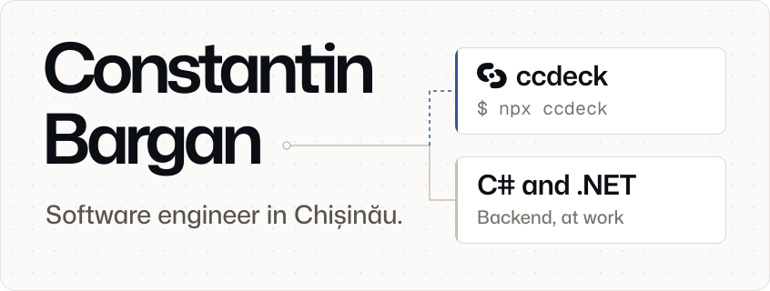

<p><a href="https://ccdeck.dev"><picture><source media="(prefers-color-scheme: dark)" srcset="assets/banner-dark.svg"></picture></a></p>

I write C# and .NET backends for a living, in Chișinău, Moldova. After hours I build **[ccdeck](https://ccdeck.dev)**, a local dashboard for Claude Code and Codex CLI. It shows which session is waiting on you, every subagent and tool call as it runs, and the cost and quota left. Free and open source, with about 17,000 npm downloads in September 2026.

```bash
npx ccdeck
```

There is also a [desktop app](https://github.com/BarganConstantin/ccdeck/releases/latest) for macOS, Windows and Linux.

Most other public repos here are university coursework; the code I write at work is private.

<sub>[ccdeck.dev](https://ccdeck.dev) · [Source](https://github.com/BarganConstantin/ccdeck) · [Guides](https://ccdeck.dev/guides/) · [npm](https://www.npmjs.com/package/ccdeck)</sub>
